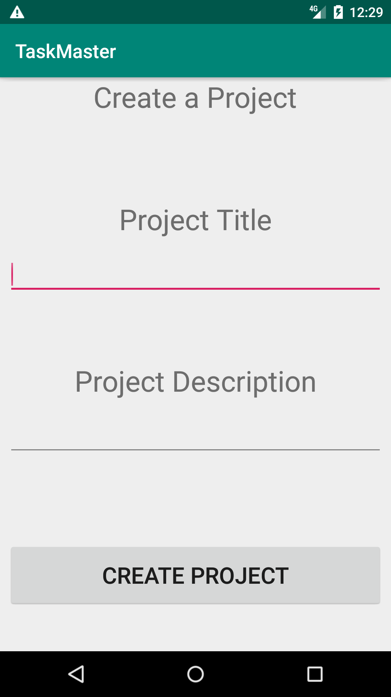

# Task Master
Health Tracker (Android Mobile)

## Functionality
Task Master performs the following activities:

#### Project
* Users should be able to create a Project.
* Users should be able to add a task to a Project.
* Both Tasks and Projects should be saved locally to a database.

#### Tasks
* A user should be able to “Assign” themselves a task, “Accept” that task, and later “Complete” that task.
* A task should have one property which represents what state the task is in.
  * `Available` - the task has been created, and is publicly available, but no other user has claimed it yet
  * `Assigned` - someone has been assigned that task
  * `Accepted` - the assignee has accepted that task
  * `Finished` - the task is totally complete. Write tests making sure a task progresses through it’s states properly

  #### Firebase
* Users should be able to log in.
* At a minimum, they should be able to log in with email and password.
* Users should be able to see all the Projects in a cloud database, and add Tasks to those projects.

  * (Hint: In a NoSQL database, there are many options for how to store Tasks associated with Projects and Users. Read the Firebase documentation on structuring data carefully, and have fun exploring!)
* A user should be able to “Assign” a task to themself or another user.
* The user assigned to a task should be able to “Accept” that task, and later “Complete” that task.

## Change Log
#### 1/28/2019
- Initialized repo
- Created new Android project
- Added dependencies

#### 1/29/2019
- Achieved basic functionality to add a project and view in recycler on MainActivity.

## Activity Screenshots
#### Main Activity

  

#### Project Activity

  

## Resources
* Code review Day 41 pt 1 informed project creation

## Helpful Human Collaborators
* Special thanks to Team Alpha Table (Jessica Lovell, Evan Slaton, Jeff Borda, Dan Logerstedt and Zahra Mohamed) for always being willing to help a guy out when needed with direction and correction.

